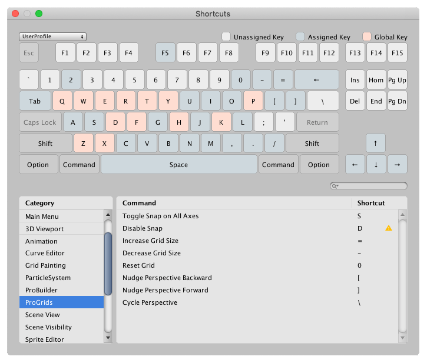
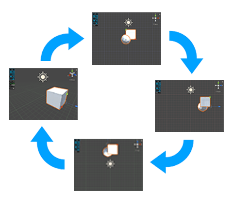

# Keyboard Shortcuts

By default, ProGrids assigns shortcut keys to some common ProGrids actions. If you want to change the key assignments, use one of the following methods to choose a new key (including joystick buttons):

* In Unity versions prior to 2019.1, select the key from the drop-down lists on the [ProGrids preferences](preferences.md#shortcuts) window. 
* In Unity versions starting with 2019.1, open the [Shortcut Manager](https://docs.unity3d.com/Manual/ShortcutsManager.html) to modify your key selections:

The default key mapping for these ProGrid commands are:

| **ProGrids command**      | **Default key mapping:** | **Description**                                              |
| :----------------------------- | ------------------------ | :----------------------------------------------------------- |
| **Toggle Snap on All Axes**    | **S**                    | Hold **S** to switch to the other [snapping method](preferences.md#behavior). For example, if your **Snap Method** preference is set to **Snap On Selected Axis**, then when you hold **S** down while you move the object, it snaps it on all three axes at once until you release the **S** key. |
| **Disable Snap**               | **D**                    | Hold **D** to temporarily suspend snapping. As soon as you release the key, snapping is enabled again. |
| **Increase Grid Size**         | **=**                    | Doubles the [snap value increment](snapping.md).             |
| **Decrease Grid Size**         | **-**                    | Halves the [snap value increment](snapping.md).              |
| **Reset Grid**    | **0** (zero) | Resets any grid adjustments made by [nudging](snapping.md) (that is, increasing or decreasing the size of the [Snap Value](snapping.md)). |
| **Nudge Perspective Backward** | **[**                    | Moves the grid backward along its axis when objects [follow the grid](preferences.md#follow). |
| **Nudge Perspective Forward**  | **]**                    | Moves the grid forward along its axis when objects [follow the grid](preferences.md#follow). |
| **Cycle Perspective**          | **\\** (backslash) | Cycle through the Scene view Camera orientations in this order:  orthographic X -&gt; orthographic Y -&gt; orthographic Z -&gt; perspective (free) -&gt; orthographic X (again).   |

These shortcuts are only available when the Scene view is active.