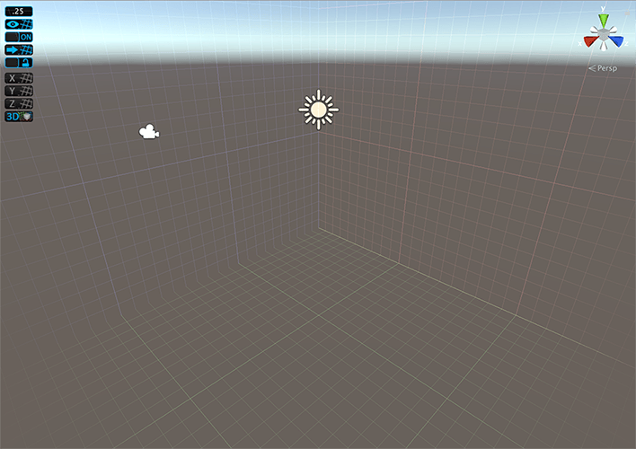

# About ProGrids

Grid snapping keeps objects aligned and evenly spaced. This is an important part of just about every level design workflow.

When you use ProGrids snapping in Unity, any object you move snaps to the **world grid** as you move it. The world grid never changes position or orientation. This means you always know exactly where items are, how far they are from each other, and how far you are moving them.

## ProGrids and ProBuilder

ProGrids helps you build levels and greybox with [ProBuilder](https://docs.unity3d.com/Packages/com.unity.probuilder@latest) by helping you create proportional, clean geometry that you can easily resize and expand. For example, if you snap to the grid while creating your geometry, it's easy to end up with perfectly straight right angles.

ProGrids also provides excellent visual cues to help you extrude faces and edges evenly because the grid is in world space.

You can use the larger snap values to create the exterior walls, and then switch to smaller snap values to create insets or details.

## Helpful Links

- [Installing ProGrids](install.md)
- [Getting Started tutorial](https://youtu.be/1G-0f5m1_lw)
- [Documentation](https://docs.unity3d.com/Packages/com.unity.progrids@latest)
- [Support forum](https://forum.unity.com/forums/world-building.146/)

