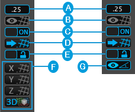
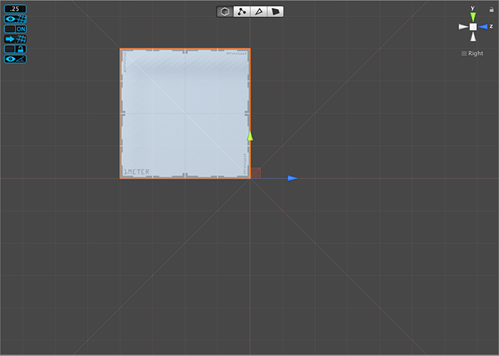

# The Interface

 

 [Snap Settings](snapping.md). Set the size of the grid's snapping increment. 

 [Grid Visibility](#grid-vis). Toggle whether to display or hide gridlines in the Scene view.

 [Snapping Enabled](#snap). Toggle whether to snap objects to the grid on or off. 

 [Push to Grid](#push). Snap all selected object(s) to the grid.  

 [Follow Grid](#follow). Lock the perspective grid in place. 

 [Set Grid Planes](grids.md). You can choose to display the grid for a single axis (**X**, **Y**, **Z**) or all three at once (the **Perspective Grid**). These buttons are only available when the Scene view is set to the [perspective mode](https://docs.unity3d.com/Manual/SceneViewNavigation.html).

 [Angle Visibility](#angle-vis). Toggle the visibility of the angle guides. This button is only available when the Scene view is set to the [orthographic mode](https://docs.unity3d.com/Manual/SceneViewNavigation.html).

> **TIP**: You can use [Keyboard Shortcuts](hotkeys.md) to change these settings quickly.

##  Grid Visibility

Use this button to switch between whether the grid is visible or not. 

When you enable or disable this setting it only affects the visibility of the grid. Objects still snap to the grid even when you disable grid visibility.

##  Snapping Enabled

Use this button to enable or disable snapping to the grid when you move objects. 

Make sure your [Gizmo handle](https://docs.unity3d.com/Manual/PositioningGameObjects.html#GizmoHandlePositions) is set to **Pivot**. When you use snapping with the handle position set to **Center** it may produce unexpected behavior.

##  Push to Grid

Use this button to move all selected objects to positions on the grid, on all axes.  

This is useful when you enable to snapping to the grid to adjust objects in your Scene that you created before.

##  Follow Grid

Use this button to lock the grid on its current axis. For example, if the Y grid is visible, the lock determines if it moves up or down with the object:

* When you disable **Follow Grid**, the grid is locked, which means the grid stays in place on the Y axis.
* When you enable **Follow Grid**, the grid is unlocked, which means the grid matches the selected object's Y position as closely as possible.

> **TIP**: If you disable  **Follow Grid**, you can "nudge" the X, Y, or Z grid along its axis by using the bracket (**[ ]**) [keyboard shortcuts](hotkeys.md).

##  Angle Visibility

Use this button to toggle the visibility of the angle guides when the Scene view is set to [orthographic mode](https://docs.unity3d.com/Manual/SceneViewNavigation.html).

 

For example, you can see two diagonal lines appearing in this image in addition to the standard ProGrids horizontal and vertical lines. 

The default angle of these lines is 45 degrees. To change the default angle, set the [Angle](#ortho-angle) property in the [Snap Settings](snapping.md).