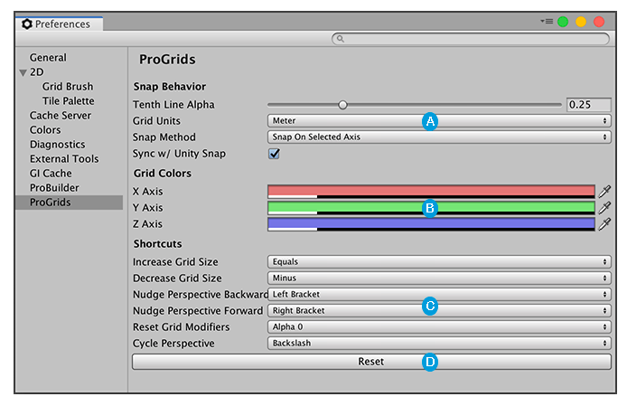
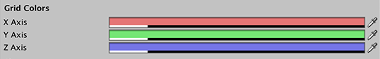
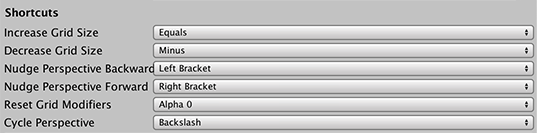

# Customizing ProGrids

You can customize many ProGrids features to suit your needs and workflow. For example, you can set custom grid planes, colors, and snap increments.

To access the **ProGrids** tab on the **Preferences** window, go to **Edit** > **Preferences** (Windows) or **Unity** > **Preferences** (Mac) from the main menu in Unity, then select the **ProGrids** category. 

 

 Use the [Snap Behavior](#behavior) section to customize ProGrids snapping behavior.

 Use the [Grid Colors](#colors) section to customize how the grid appears.

 Use the [Shortcuts](#shortcuts) section to assign common ProGrids behavior to keys (including joystick buttons).

 Click the **Reset** button to remove all customization and return to ProGrids defaults.

## Snap behavior

These properties control how you interact with ProGrids snapping:

| **Property** | **Description** |
|:--|:--|
|**Tenth Line Alpha** | Every tenth grid line appears more opaque. This value sets that opacity. |
|**Grid Units** | Choose the unit of measurement for the snap value.  Units are in meters by default, but you can also use centimeters, millimeters, inches, feet, yards and parsecs. |
|**Snap Method** | Choose how ProGrids snaps objects you translate to the grid: |
| | **Snap On Selected Axis**: ProGrids snaps only on the selected axis. |
| | **Snap On All Axes**: ProGrids snaps on all three axes at once. |
|**Sync w/ Unity Snap** | Enable this option to update the [Unit snapping](https://docs.unity3d.com/Manual/PositioningGameObjects.html#UnitSnapping) value to match the [Snap Value](snapping.md) property every time you update the **Snap Value** property. |

## Grid Colors

 

Set the colors you want to appear on each [grid axis](grids.md). 

This applies to both [orthographic and perspective](https://docs.unity3d.com/Manual/SceneViewNavigation.html) modes.

## Shortcuts

 

By default, ProGrids assigns shortcut keys to some common ProGrids actions. If you want to change the key assignments, you can choose a key (including joystick buttons) from these drop-down menus. 

For more information, see [Keyboard Shortcuts](hotkeys.md).