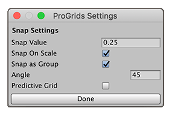

#  Snap Settings

Use this button to open the **ProGrids Settings** window, where you can set the size (or value) of the snap increment and control the general behavior of ProGrids snapping.

| **Property** | **Description** |
|:--|:--|
| **Snap Value** | Set the increment to snap objects to the grid in World coordinates. You can specify a small snapping size, such as 0.25 units to snap to the grid at every quarter meter. Or you can use a larger value, such as 1.0 unit.  **TIP**: You can also use the **=** and **-** [keyboard shortcuts](hotkeys.md) to quickly increase or decrease (*nudge*) this value without opening the **ProGrids Settings** window. You can also change the keyboard shortcuts for nudging in the **Shortcuts** section of the [ProGrids preferences](preferences.md#shortcuts).  Units are in meters by default, but you can choose a different unit of measurement with the [Grid Units preference](preferences.md). |
| **Snap On Scale** | Enable this option to snap to the grid while you scale the object. |
| **Snap as Group** | Enable this option to keep the relative positions of multiple selected objects when you move them. |
| **Angle** | Set the angle of the additional line that displays when you enable the [Angle Visibility](interface.md#angle-vis) () setting. |
| **Predictive Grid** | Enable this option if you want ProGrids to automatically set the [rendering grid plane](grids.md) according to object movement. For example, if you enable this option and you move your object along the X axis, ProGrids switches to the Z grid plane ().  This option has no effect when the 3D grid plane () is active. |

