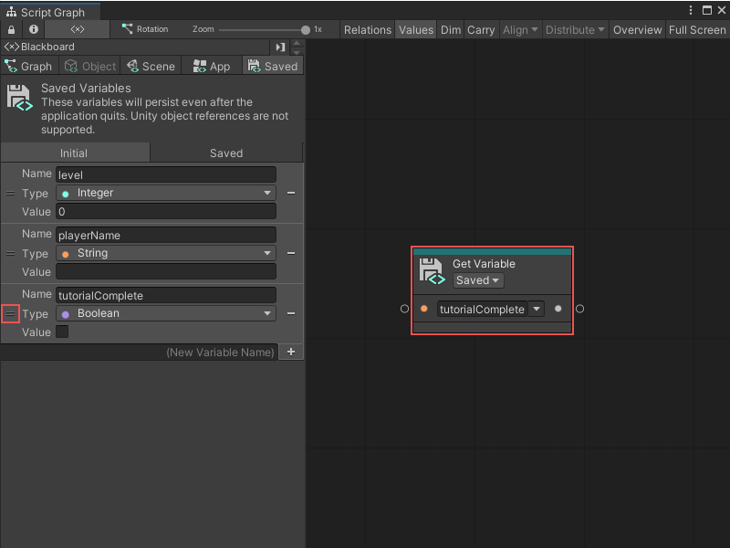
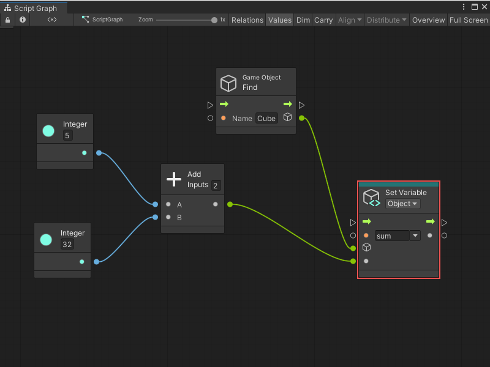

# Create and add a variable to a Script Graph

You can create and add a variable to a Script Graph in one of two ways: use the Graph window's Blackboard, or add a node to a graph.

> [!NOTE]
> You can't add a Flow variable to your graph from the Blackboard. For more information on Flow variables, see [Variables](vs-variables.md).

## Create and add a new variable through the Blackboard

To create a new variable in the Blackboard and add it to your graph: 

1. With a graph [open in the Graph window](vs-open-graph-edit.md), in the Blackboard, select the scope for the variable you want to add: **Graph**, **Object**, **Scene**, **App**, or **Saved**. For more information on variable scopes and when you can use each scope in your graph, see [Variables](vs-variables.md).

    > [!TIP]
    > If the Blackboard isn't visible in the Graph window, select **Blackboard** () from the toolbar.

2. In the **(New Variable Name)** field, enter a name for your new variable, then press Enter or select the **Add Variable** (+) button. 

3. In the **Type** list, select the data type for your variable. For more information on types, see [Object types](vs-types.md).

4. (Optional) In the **Value** field, enter or modify the default value for your variable. 

5. To add the node to your graph, click and drag from the Handle (=) on the variable's definition in the Blackboard into the Graph Editor. Visual Scripting adds a new Get Variable node for your variable to your graph:

## Create and add a new variable through the Graph Editor

To create a Flow variable or another new variable directly in your graph: 

1. With a graph [open in the Graph window](vs-open-graph-edit.md), right-click inside the Graph Editor to open the Fuzzy Finder. 

2. Select the **Variables** category, then select the scope for the variable you want to add: **Flow**, **Graph**, **Object**, **Scene**, **Application**, or **Saved**. For more information on variable scopes and when you can use each scope in your graph, see [Variables](vs-variables.md).

3. Select the **Set `<Scope>` Variable** node, where `<Scope>` is the scope you selected in the previous step. 
    Visual Scripting adds a new Set Variable node to your graph.
    
4. In the **String** text field, indicated by an orange dot on the node, enter a name for your new variable. 

5. (Object variables only) In the **GameObject** field, indicated by a GameObject icon on the node, specify the GameObject where you want to create the variable. Do one of the following: 
 
    - Select the object picker (circle icon) and select a GameObject.
    - Attach a node to the field's data input port that outputs a GameObject. 
    - Leave the field as the default value of **This** to use the GameObject where you attached your Script Graph to a Script Machine.

6. (Optional) To set a default value for your variable, connect another node that outputs the value you want to the Set Variable node's data input port. 

## Next steps 

Once you've added a variable to your graph, you can [add nodes to your Script Graph](vs-add-node-to-graph.md), [create node groups](vs-groups.md), or [add a Subgraph](vs-add-subgraph.md).