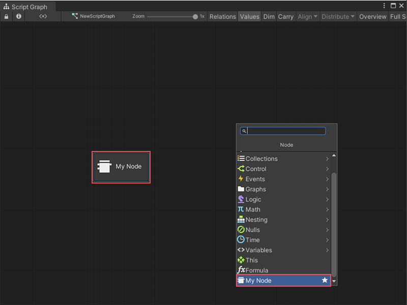
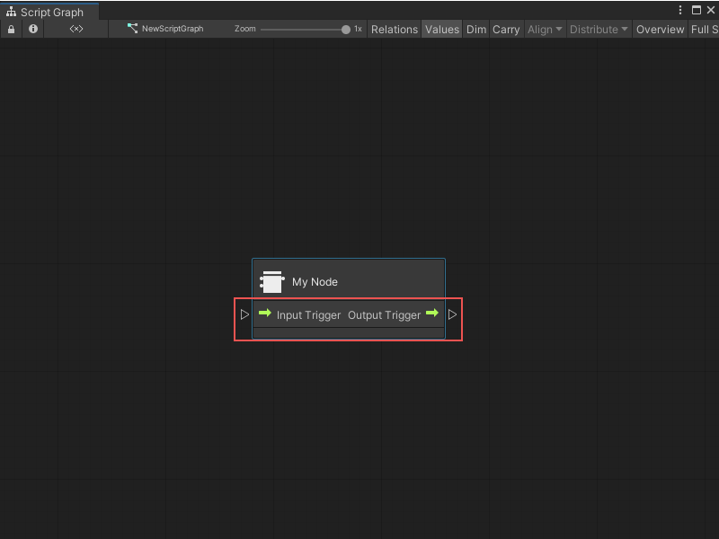
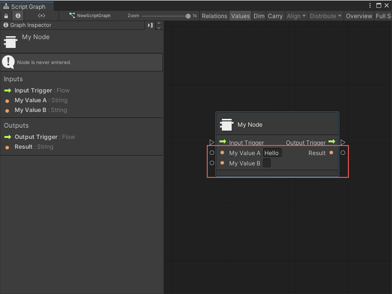
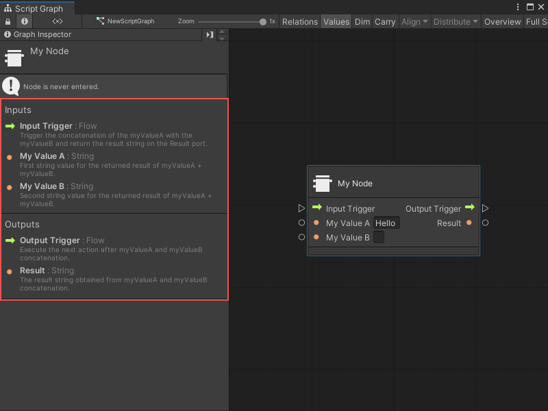
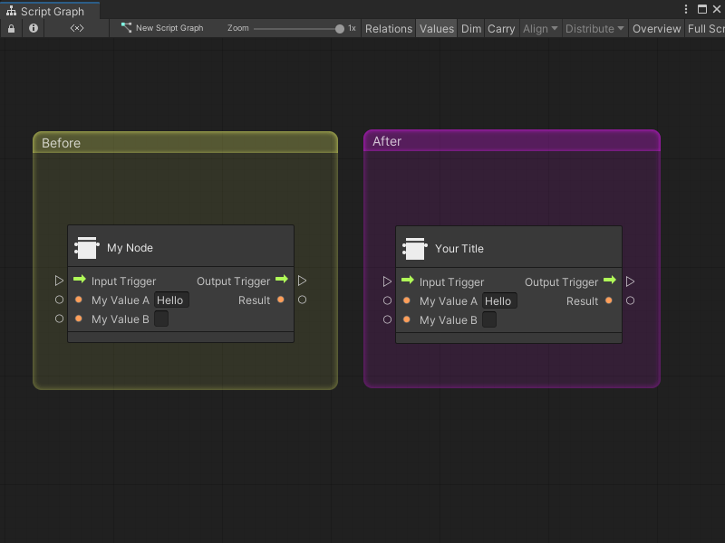
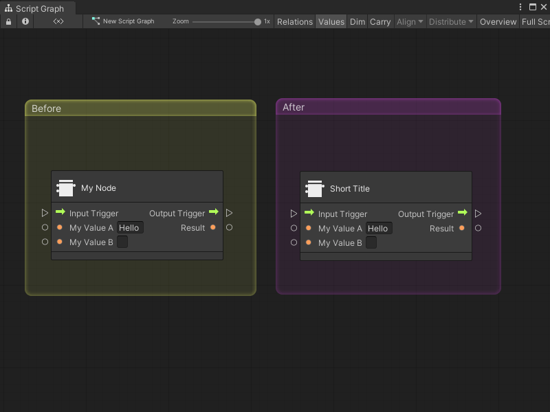
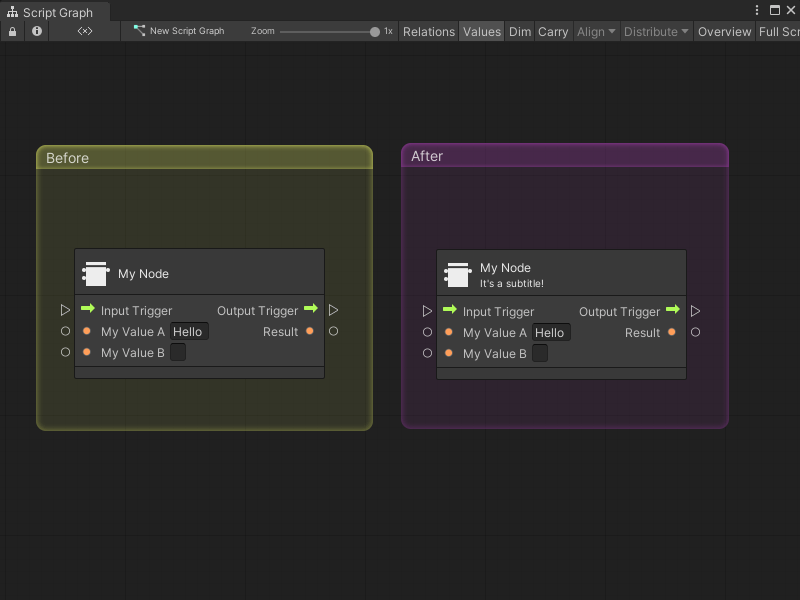
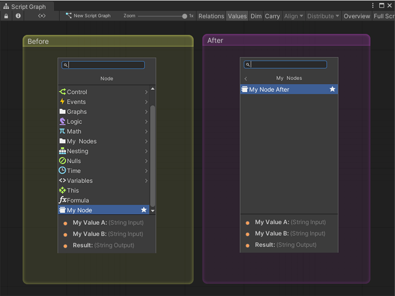
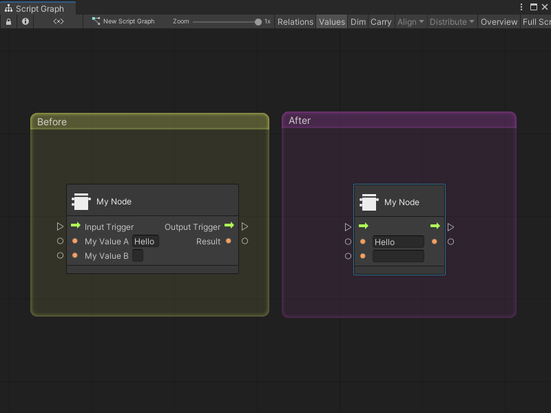

# Creating a visual script graph node


Programming in visual scripting is accomplished by connecting blocks of logic. These blocks are called nodes.

Visual Scripting has different node types that specialize in different actions: 

- **Events:** Entry point to execute your actions, for example OnStart, OnUpdate, OnButton.
- **Flow:** Nodes that must be triggered by another node to execute, for example if and set Position.
- **Data:** Nodes containing data, for example float literal and integer literal. 

## Creating a simple custom node

To create a new empty node:

1. Right-click in the project and select **Create > C# Script** to create a new C# file in your project with the name of your node.</br>
   For example, MyNode.cs. 

2. Copy, paste, and save the following code in your script.

   ```C#
   using Unity.VisualScripting;
   
   public class MyNode : Unit
   {
      protected override void Definition() //The method to set what our node will be doing.
      {
      }
   }
   ```

3. Select **Edit** > **Project Settings.**
   The Project Settings window appears.

4. In the Project Settings window select **Visual Scripting** and select **Regenerate Nodes** to add the new node to the fuzzy finder.

   

5. To add the new node in your graph, right-click on the background of any script graph. The new node is at the end of the fuzzy finder.
   
   
   Select your node from the fuzzy finder. The **My Node** node appears in your graph.
   
    
   
   

> [!NOTE]
> Visual Scripting automatically processes custom nodes. There is no need to add your C# file to the Node Library’s list.


## Adding ports and executing code

When creating a node, you must add ports:

- To let the users add data to be interpreted.
- To set control ports to let the user trigger both the node and other nodes after the current node action is done. 

You can create four different types of ports on the node to achieve this.

Ports:

- **ControlInput:** Entry point to execute logic in the node.
- **ControlOutput:** Trigger the next action connected to this port.
- **ValueInput:** Any kind of data you want to pass to your node.
- **ValueOutput:** Any kind of data you want to pass outside your node.


### Adding control ports

To have the ports appear on the node:

1. Add the ports variable you want of type **ControlInput** and **ControlOutput** .
2. Use the port variable in the **Definition** method.


```C#
using Unity.VisualScripting;

public class MyNode : Unit
{
   [DoNotSerialize] // No need to serialize ports.
   public ControlInput inputTrigger; //Adding the ControlInput port variable

   [DoNotSerialize] // No need to serialize ports.
   public ControlOutput outputTrigger;//Adding the ControlOutput port variable.

   protected override void Definition()
   {
       //Making the ControlInput port visible, setting its key and running the anonymous action method to pass the flow to the outputTrigger port.
       inputTrigger = ControlInput("inputTrigger", (flow) => { return outputTrigger; });
       //Making the ControlOutput port visible and setting its key.
       outputTrigger = ControlOutput("outputTrigger");
   }
}

```


You should now have a basic and functional Flow Routing node that can be connected to other control ports. You can use the Flow Routing node to change the direction of the flow in your graph to avoid unstructured and difficult-to-maintain visual source code





### Adding value ports 

To add a value port, you must define the type of data you want to input in your node. There are two types of data:

- **Generic:** An object type that you can use to input any types and let your code handle the data how you want.
- **Type Value:** Used to enforce certain data types for example string, integer and floats.

The example code below adds two input values of the type string and an output value of the type string. You can also add a default value: in the example below, the default string value of myValueA is set to “Hello”.


```C#
using Unity.VisualScripting;

public class MyNode : Unit
{
  [DoNotSerialize]
  public ControlInput inputTrigger;

  [DoNotSerialize]
  public ControlOutput outputTrigger;

  [DoNotSerialize] // No need to serialize ports
  public ValueInput myValueA; // Adding the ValueInput variable for myValueA

  [DoNotSerialize] // No need to serialize ports
  public ValueInput myValueB; // Adding the ValueInput variable for myValueB

  [DoNotSerialize] // No need to serialize ports
  public ValueOutput result; // Adding the ValueOutput variable for result

  private string resultValue; // Adding the string variable for the processed result value
  protected override void Definition()
  {
      inputTrigger = ControlInput("inputTrigger", (flow) => { return outputTrigger; });
      outputTrigger = ControlOutput("outputTrigger");
    
      //Making the myValueA input value port visible, setting the port label name to myValueA and setting its default value to Hello.
      myValueA = ValueInput<string>("myValueA", "Hello ");
      //Making the myValueB input value port visible, setting the port label name to myValueB and setting its default value to an empty string.
      myValueB = ValueInput<string>("myValueB", string.Empty);
      //Making the result output value port visible, setting the port label name to result and setting its default value to the resultValue variable.
      result = ValueOutput<string>("result", (flow) => { return resultValue; });
  }
}

```

If you try to connect the current node, the flow passes through it, but the Result value is null because the value in the **resultValue** variable isn’t set.





## Executing logic within the node


The created node concatenates two strings and outputs them as one string when the **ControlInput** name **inputTrigger** is triggered. To do this, add the logic within the lambda expression handling the assignment of the **ControlInput** inputTrigger.

For example: within the code flow, add this simple operation (**myValueA + myValueB**).

> [!NOTE]
> The values come from the input ports.

```C#
flow.GetValue<string>(myValueA) + flow.GetValue<string>(myValueB) + "!!!";
```


Your code should look like this:

```C#

using System;
using Unity.VisualScripting;

public class MyNode : Unit
{
   [DoNotSerialize]
   public ControlInput inputTrigger;

   [DoNotSerialize]
   public ControlOutput outputTrigger;

   [DoNotSerialize]
   public ValueInput myValueA;

   [DoNotSerialize]
   public ValueInput myValueB;

   [DoNotSerialize]
   public ValueOutput result;

   private string resultValue;
   protected override void Definition()
   {
       //The lambda to execute our node action when the inputTrigger port is triggered.
       inputTrigger = ControlInput("inputTrigger", (flow) =>
       {
           //Making the resultValue equal to the input value from myValueA concatenating it with myValueB.
           resultValue = flow.GetValue<string>(myValueA) + flow.GetValue<string>(myValueB) + "!!!";
           return outputTrigger;
       });
       outputTrigger = ControlOutput("outputTrigger");
    
       myValueA = ValueInput<string>("myValueA", "Hello ");
       myValueB = ValueInput<string>("myValueB", String.Empty);
       result = ValueOutput<string>("result", (flow) => resultValue);
   }
}


```


## Adding relations


Relations are the way for a node to display its internal flow. Not setting up the relation can create visual problems when connecting nodes to the control ports. There are three different types of relations that you can add to your nodes:

- **Assignment:** Represents the port you need to be executed to output the data you want.
- **Succession:** Represents the path to be executed from the input port to the output port. Not setting your succession grays out the connected nodes when the Dim option is enabled in the graph. Note: the execution still proceeds regardless of the visual representation.
- **Requirement:** Represents the data you need to execute a control input port.


```C#

using System;
using Unity.VisualScripting;

public class MyNode : Unit
{
   [DoNotSerialize]
   public ControlInput inputTrigger;

   [DoNotSerialize]
   public ControlOutput outputTrigger;

   [DoNotSerialize]
   public ValueInput myValueA;

   [DoNotSerialize]
   public ValueInput myValueB;

   [DoNotSerialize]
   public ValueOutput result;

   private string resultValue;
   protected override void Definition()
   {
       inputTrigger = ControlInput("inputTrigger", (flow) =>
       {
           resultValue = flow.GetValue<string>(myValueA) + flow.GetValue<string>(myValueB) + "!!!";
           return outputTrigger;
       });
       outputTrigger = ControlOutput("outputTrigger");
    
       myValueA = ValueInput<string>("myValueA", "Hello ");
       myValueB = ValueInput<string>("myValueB", String.Empty);
       result = ValueOutput<string>("result", (flow) => resultValue);
      
       Requirement(myValueA, inputTrigger); //To display that we need the myValueA value to be set to let the node process
       Requirement(myValueB, inputTrigger); //To display that we need the myValueB value to be set to let the node process
       Succession(inputTrigger, outputTrigger); //To display that the input trigger port input will exits at the output trigger port exit. Not setting your succession also grays out the connected nodes but the execution is still done.
       Assignment(inputTrigger,result);//To display the data that is written when the inputTrigger is triggered to the result string output.
   }
}


```

The final result of your custom node in action.


## Adding documentation to the node


Adding documentation on a node is not required but helps your users to understand the purpose of the node.

To add summaries for the ports that can be read in the fuzzy finder and also in the graph inspector, create a new C# script for your current unity and place it inside an **Editor folder.**Create a new C# Script named **MyNodeDescriptor** and copy-paste the following code into it.


```C#

using Unity.VisualScripting;

[Descriptor(typeof(MyNode))]
public class MyNodeDescriptor : UnitDescriptor<MyNode>
{
   public MyNodeDescriptor(MyNode unit) : base(unit) {}

   protected override void DefinedPort(IUnitPort port, UnitPortDescription description)
   {
       base.DefinedPort(port, description);
       switch (port.key)
       {
           case "inputTrigger":
               description.summary = "Trigger the concatenation of the myValueA with the myValueB and return the result string on the Result port.";
               break;
           case "myValueA":
               description.summary = "First string value for the returned result of myValueA + myValueB.";
               break;
           case "myValueB":
               description.summary = "Second string value for the returned result of myValueA + myValueB.";
               break;
           case "outputTrigger":
               description.summary = "Execute the next action after myValueA and myValueB concatenation.";
               break;
           case "result":
               description.summary = "The result string obtained from myValueA and myValueB concatenation.";
               break;
       }
   }
}


```


When you select a node in the graph, a description for the node ports in the **Graph Inspector** appears.




## Customizing the node

Node customization is something that helps the user to understand what is happening in the graph. To customize the node, you need to set attributes on it. The following is a list of attributes that can be used to modify the look of the node.

### Node class attributes

The attributes are used to customize your node and are written before your node.

</br>
</br>

***
</br>

**Attribute**: [UnitTitle("YourTitle")]



**Info**: Title of the node when you want to use something other than the class name. 

</br>
</br>

***
</br>

**Attribute**: [UnitShortTitle("YourShortTitle")]



**Info**: UnitShortTitle displays on the node and hides the Title in the Graph view.

</br>
</br>

***
</br>


**Attribute**: [UnitSubtitle("Your Subtitle")]



**Info**: Subtitle of the node that goes to the bottom of the current node title.

</br>
</br>

***
</br>


**Attribute**: [UnitCategory("FirstLevel\\SecondLevel")]



**Info**: The virtual path to find your node in the fuzzy finder.

> [!NOTE] 
> You must regenerate nodes to update the fuzzy finder and reposition the node in the finder.


</br>
</br>

***
</br>


**Attribute**: [TypeIcon(typeof(GameObject))]

**Info**: Gets an icon from the Visual Scripting icons library; those icons are saved in a library by unity types. </br>

> [!NOTE]
> You cannot point to your own custom icons from this attribute.

</br>
</br>

***
</br>


### Ports attributes

Port attributes must be placed above the ControlInput, ControlOutput, ValueInput and ValueOutput variable initialization inside of your node class.


```c#
public class MyNode : Unit
{
   [DoNotSerialize] // Mandatory attribute, to make sure we don’t serialize data that should never be.
   [PortLabelHidden] // Hiding the port label because we normally hide the label for default Input and Output triggers.
   public ControlInput inputTrigger;
```


</br>
</br>

***
</br>
</br>


**Attribute**: [DoNotSerialize]

**Before**: Not applicable

**After**: Not applicable

**Info**: Mandatory attribute port for all ports. Necessary so that data that is not meant to be serialized isn’t serialized.


</br>
</br>

***
</br>

**Attribute**: [PortLabelHidden]



**Info**: Hides the text label on the side of the port icon.

> [!NOTE]
> If the label isn’t hidden, make sure that the port variable is the same as your key in the **Definition**: method.

For example: 

```C#
myValueA = ValueInput<string>("myValueA", "Hello ");
```
</br>
</br>

***
</br>


