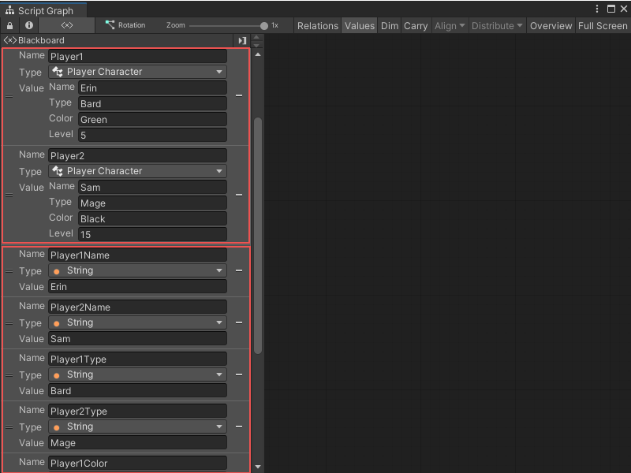

# Custom types

You can use a C# script file to create your own object types in Unity. These types are called classes. 

Classes act as blueprints for objects in your code: they determine what kind of data an object holds and what your code can do with that object. Instead of holding one value with a single data type, a class can hold multiple variables with different data types in a single object. 

After you create a custom class, you can use it as a type for your variables and other objects in your Visual Scripting Script Graphs. For more information on how to add and use your own custom types in Visual Scripting, see [Using custom types](vs-using-custom-types.md). Depending on what code you include in your C# script file, you can also create new nodes that can manipulate the data in your class. 

For example, you might need to write code to keep track of the characteristics of different player characters in your application. You could create a class, `Player`, and have different variables in that class for name, character type, favorite color, or player level:

```csharp
using System;
using UnityEngine;
using Unity.VisualScripting;

[Serializable, Inspectable]
public class PlayerCharacter
{
    [Inspectable]
    public string name; 
    [Inspectable]
    public string type;
    [Inspectable]
    public string color;
    [Inspectable]
    public int level;
}

```

These values could all be different across different instances of `Player` objects in your code. `Player1` could be Erin, a bard, who loves green and is level 5, and `Player2` could be Sam, a mage, who loves black and is level 15: 



If you use only variables to represent your characters and interact with them in your application, you need to create a lot of nodes: 


You can use a custom class to create a single node that represents all of a player character's information, instead of 4 separate variable nodes.  

