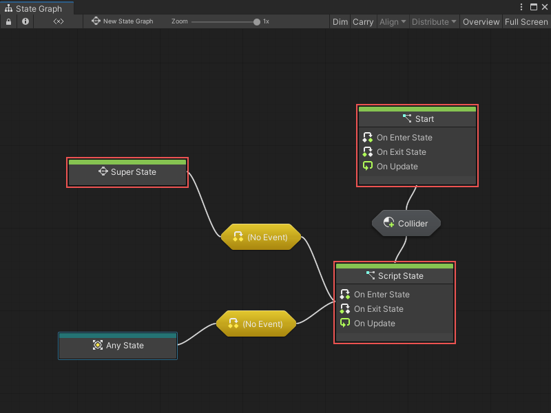

# Graphs 

One of Visual Scripting's key components is the graph. Graphs are visual representations of the logic in an application. 

Visual Scripting has two different types of graphs: Script Graphs and State Graphs. You can use either graph type in specific situations to define and change how your GameObjects behave. To use the logic in a Script Graph or State Graph, it needs to be attached to a machine. For more information on Script Machines and State Machines, see [Script Machines and State Machines](vs-graph-machine-types.md).

## Script Graphs

Script Graphs control and connect specific actions and values. The actions in a Script Graph happen in a specific order. Actions could happen every frame, or when a specific event occurs. 

Visual Scripting represents the actions in a Script Graph through nodes. For more information on nodes, see [Nodes](vs-nodes.md). 

In a Script Graph, you can connect nodes together and use them to tell your application what it should do, and in what order. 

Script Graphs can access a large collection of nodes, which correspond to different features and functionality in the Unity Editor. You can access these nodes through Visual Scripting's fuzzy finder. For more information on the fuzzy finder, see [The Visual Scripting interface](vs-interface-overview.md#the-fuzzy-finder).

Script Graphs provide a useful way to define the specifics of what a GameObject should be doing while your application is running. 

## State Graphs

A State Graph contains states and provides the logic for when your application should move between states, through connections called transitions. A state is any set of behaviors that you want a GameObject to perform. Visual Scripting represents states in State Graphs through nodes.

In a State Graph, a state node could provide a new Script Graph, with new logic for your application to follow, or provide another State Graph with additional transitions and state nodes.

The logic in a State Graph tells your application when it should change its behavior, based on an event or after it fulfills a condition. 

For example, in a game, you might have an enemy character with Patrol and Chase states. The enemy character's actions could change from the actions in the Script Graph for the Patrol state to the actions for the Chase state after it detects the player character. The event of the enemy detecting the player character triggers the transition between the two states. 

State Graphs don't use the fuzzy finder; instead they use a specific set of State nodes: 

- **Script States** contain a Script Graph. When your application triggers a Script State, Visual Scripting runs the logic in your Script State's attached Script Graph. Script States use On Enter State Event, On Update Event, and On Exit State Event nodes to control logic based on the current state.

- **Super States** contain another, nested State Graph. A Super State can help you better organize your State Graph, and reuse states and transitions across multiple graphs.

- **Any States** serve as a placeholder for any other state in your State Graph. Instead of creating multiple transitions from other states in your graph to a single state, you can use an Any State node and create a single transition to a new state. 

- **Transitions** connect Script States, Any States, and Super States. Transitions contain Script Graphs that tell your application when it should switch from one state to the next. For more information, see [Transitions](vs-transitions.md).

You can set any Script State node or Super State node to be a **Start State**. Any state marked as a Start State is automatically active when Visual Scripting starts running a State Graph. You can also have multiple Start States in a single graph: 

State Graphs are useful for designing AI behavior, or defining scene and level structures.
