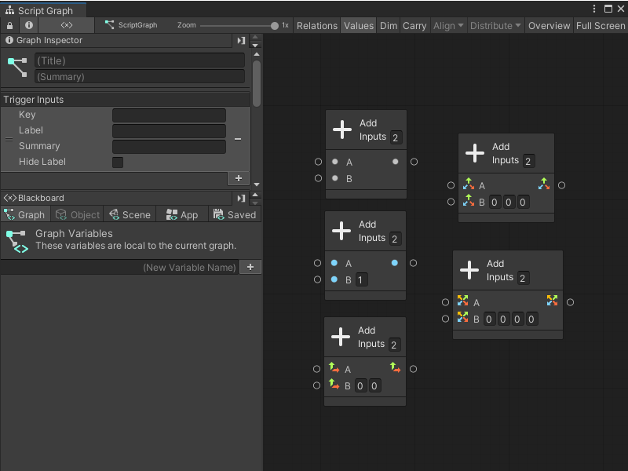

# Nodes 

Nodes are the most basic part of creating scripts in Visual Scripting. They can do a variety of things; for example, they can listen for events, get the value of a variable, or modify a component on a GameObject.  

Nodes appear as "blocks" in the Graph Editor: 

You can arrange and connect these blocks to create logic for your application.

## Node anatomy

Visual Scripting highlights the nodes in your current selection. All nodes have a header, which displays the node's name. 

If you select a node in your graph, the Visual Scripting Graph Inspector displays the following information: 

- The node's name and icon. 
- If applicable, a brief description of what the node does. 
- If applicable, any current warning messages or errors for the node. 
- If applicable, any additional settings for the node. 
- The required type for each input and output port, which might also include a brief description of each port.

For more information on the Graph Inspector, see [The Visual Scripting interface](vs-interface-overview.md).

### Connections and ports

You can connect a port from one node to a compatible port on another node, to create a logical flow in your Visual Scripting graphs. Visual Scripting highlights ports on any other nodes in your graph where you can make a valid connection, and dims any nodes or ports where there isn't a valid connection. 

Connections are also color-coded: connections that control the logic flow in your graph are white, and connections for values are colored based on the value's type. For more information about types, see [Object types](vs-types.md).

Ports on the left side of a node are **Input Ports**. Ports on the right side of a node are **Output Ports**. 

Input and output ports can also have different types: 

|**Port**|**Description** |
| :--- | :--- |
|__Control Ports__ | Control ports control the logical flow of your graphs. They tell Visual Scripting what order it should execute the nodes in a graph, from left to right. The arrows located beside these ports display the direction of the flow of logic in your graph.|
|__Data Ports__ | Data ports send and receive data, such as number values or GameObjects, between nodes. They also have colors that correspond to the specific type they expect to receive as inputs, or send as outputs. | 

You can make multiple connections from a single Data Output port to different Data Input ports, or have multiple Control Output ports that connet to a single Control Input: 

You can't connect multiple Data Output ports to a single Data Input port, because it wouldn't be clear which value Visual Scripting should use in your application. You also can't connect a single Control Output port to multiple Control Input ports, because Visual Scripting wouldn't know which node to run first. 

For more information on how to connect nodes, see [Connect nodes in a Script Graph](vs-creating-connections.md).

Nodes can also have additional parameters, which might or might not be connected to a port, like the following: 

<table>
<thead>
<tr>
<th><strong>Element</strong></th>
<th><strong>Example</strong></th>
<th><strong>Description</strong></th>
</tr>
</thead>
<tbody>
<tr>
<td><strong>Container Type</strong></td>
<td> </td>
<td>Some nodes might require you to specify a container type, which tells the node what type it should expect as an input. For example, by a container type might tell a node that it should expect to receive a GameObject instead of a Script Machine.</td>
</tr>
<tr>
<td><strong>Kind</strong></td>
<td>  </td>
<td>Some nodes might require you to specify a kind, which tells the node which variable scope it should use to locate the variable given as an input. For example, a kind might tell a node to look for the variable <code>Count</code> as a Graph variable, rather than a Scene variable.</td>
</tr>
<tr>
<td><strong>Inline Value</strong></td>
<td> </td>
<td>Instead of connecting to another node to receive a value, you can use a node's Inline Value field. Not all Visual Scripting types support Inline Value fields, but they can help to simplify your graphs.</td>
</tr>
</tbody>
</table>

More complex nodes can have more complex or specialized ports, outside of the ports described here.
 

## Node overloads 

A Visual Scripting node can have multiple variations, called overloads. Overloads change the input and output data that a node can accept, and can change the number of input or output data ports on a node.

For example, the **Add** node has four overloads, as shown in the fuzzy finder after a search for `Add`: 

You can distinguish each overload through its subcategory in the Fuzzy Finder. The **Add** node is a part of the **Math** category, but each overload is a part of a different subcategory: **Generic**, **Scalar**, **Vector 2**, **Vector 3**, or **Vector 4**. 

The specific node overload changes what input and output data the **Add** node can accept. While a Generic **Add** node can input and output any object type in Visual Scripting, a Vector 3 **Add** node can only take 3D vectors as an input, and can only output a single 3D vector:

The default type and number of ports on the **Add** node stays consistent. For the **Rotate** node, the type and number of ports varies across its overloads: 

Depending on the **Rotate** node you select, you might be able to specify the angle of rotation as a vector, as separate float values, or as an angle relative to each axis. You can also choose whether the node should rotate the GameObject relative to itself, or relative to the center of your application's world space.
