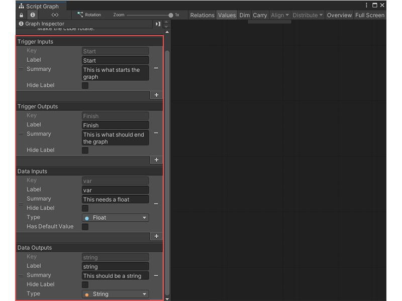
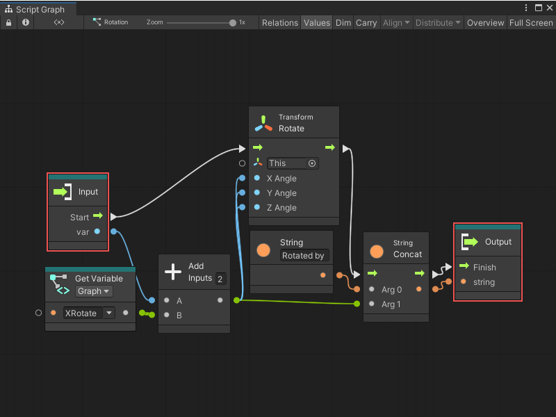

# Subgraphs

In a Script Graph, you can add a node that links directly to another Script Graph. A nested Script Graph is called a Subgraph. 

A Subgraph can be embedded in the node that adds it to a graph, or it can be a link to an external graph file. 

Subgraphs can help you to reuse and organize logic across your application. You can configure a Subgraph to take inputs or send outputs back to its parent graph. 

## Subgraph inputs and outputs

In the Graph Inspector for any graph, you can choose and define the ports that appear when you use that graph as a Subgraph: 

After you define ports for a graph, the ports appear on any Subgraph node that links to your graph: 

These port definitions also change the **Input** and **Output** nodes that control the execution and flow between your Subgraph and its parent graph: 

You can only use a single **Input** node and a single **Output** node in a Subgraph. If you try to add multiple **Input** or **Output** nodes, Visual Scripting only uses the first **Input** and **Output** nodes you added to your graph. 

The following table outlines how each option affects the Subgraph node for your graph and its **Input** and **Output** nodes. 

<table>
<thead>
<tr>
<th><strong>Port Type</strong></th>
<th><strong>Subgraph Node</strong></th>
<th><strong>Input/Output Node</strong></th>
</tr>
</thead>
<tbody>
<tr>
<td><strong>Trigger Inputs</strong></td>
<td>Define a Trigger Input to add a control input port to the Subgraph node for your Script Graph. Trigger Inputs let you choose which action or actions from a parent graph should trigger Visual Scripting to run the logic in your Script Graph when you use it as a Subgraph.</td>
<td>Define a Trigger Input to add a control output port to any Input node you add to your Script Graph. Adding a Trigger Input and an Input node to your Script Graph lets you choose which actions from a parent graph should trigger specific logic in your Script Graph when you use it as a Subgraph.</td>
</tr>
<tr>
<td><strong>Trigger Outputs</strong></td>
<td>Define a Trigger Output to add a control output port to the Subgraph node for your Script Graph. Trigger Outputs let you choose what action Visual Scripting should take after the logic contained in your Script Graph is finished when you use it as a Subgraph.</td>
<td>Define a Trigger Output to add a control input port to any Output node you add to your Script Graph. Adding a Trigger Output and an Output node to your Script Graph lets you choose which actions in your Script Graph should cause Visual Scripting to return to the logic in a parent graph when you use your Script Graph as a Subgraph.</td>
</tr>
<tr>
<td><strong>Data Inputs</strong></td>
<td>Define a Data Input to add a data input port to the Subgraph node for your Script Graph. Data Inputs let you receive input data from a parent graph when you use your Script Graph as a Subgraph.</td>
<td>Define a Data Input to add a data output port to any Input node you add to your Script Graph. Adding a Data Input and an Input node lets you receive data from a parent graph and use it inside your Script Graph when you use it as a Subgraph.</td>
</tr>
<tr>
<td><strong>Data Outputs</strong></td>
<td>Define a Data Output to add a data output port to the Subgraph node for your Script Graph. Data Outputs let you send data to a parent graph when you use your Script Graph as a Subgraph.</td>
<td>Define a Data Output to add a data input port to any Output node you add to your Script Graph. Adding a Data Output and an Output node lets you send data from your Script Graph to its parent graph when you use it as a Subgraph.</td>
</tr>
</tbody>
</table>

When you define Triggers and Data Inputs and Outputs, you must provide a unique **Key** and specify a type. You can't have two inputs or outputs with the same **Key**. If you have two **Key** values that are the same on the same graph, Visual Scripting ignores the second port definition and displays an error. 

If you change the **Key** value for a port after you've made a connection, those connections break and you need to reconnect them.

