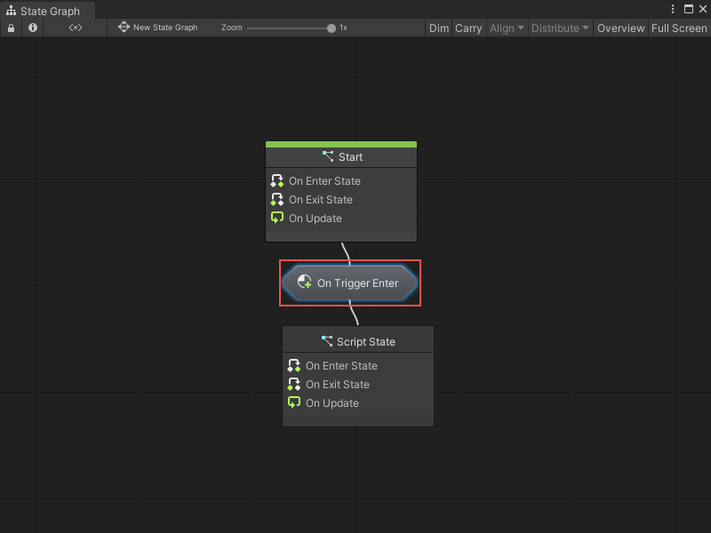

# Transitions

Visual Scripting uses Script Graphs called transitions to decide when to switch states in a State Graph. 

Just like a Script Machine or State Machine, you can embed the graph for the transition in the transition node itself, or link to an external graph file. For more information, see Source types for Script Machines and State Machines in [Script Machines and State Machines](vs-graph-machine-types.md#source-types-for-script-machines-and-state-machines). 

You can use Event nodes and a Trigger Transition node in your transition Script Graph to choose which event or events need to occur to trigger a change of state in your parent State Graph. 

For example, if you want Visual Scripting to switch states after a GameObject with the Player tag enters a trigger Collider, your transition graph could look like the following: 

In the parent State Graph, any transition nodes with a configured transition Script Graph display the name of the event in the transition Script Graph that triggers the state switch:

If you've assigned a name to your transition Script Graph from the Graph Inspector, the assigned name appears on the transition node. 

> [!TIP]
> If you want your transition nodes to take up less space in your State Graphs, you can choose to hide their name labels. For more information, see State Graphs preferences in [Configuring your preferences](vs-set-preferences.md#state-graphs-preferences).

You can create any number of transitions between states in a State Graph. You can use a self transition to make a state transition to itself. For more information on creating transitions, see [Create a transition between states](vs-creating-transition.md).
