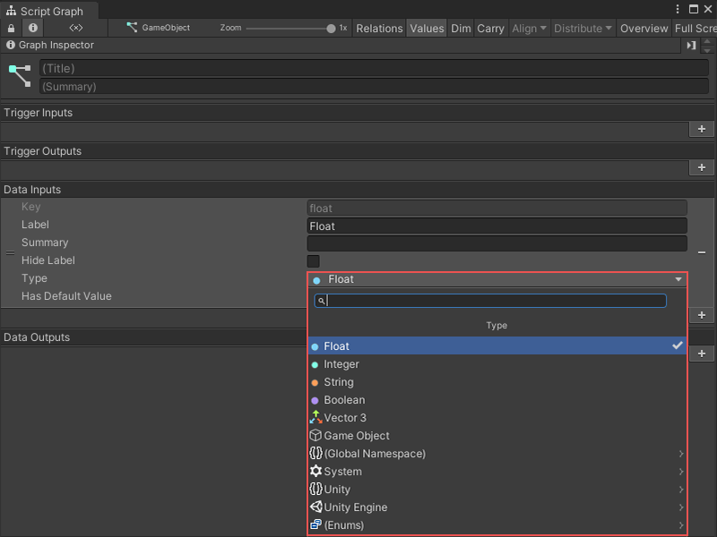

# Object types 

All scripting in Unity is based on the C# programming language. C# is known as a "strongly typed" language. This means that all data and objects in Visual Scripting have a specific type. For example, a variable could be a number value with an `integer` type, or the object provided by a node's output port could be a GameObject. 

Types help the computer run your Visual Scripting code. Sometimes, Visual Scripting's behavior might not depend on what object type you provide a node as an input, but in other cases, an object's type is important. 

For example, to add a new variable in the Blackboard, you need to specify the variable's type before you can assign it a value. Also, when making a connection in the Graph Editor, some nodes might have data input ports that only allow a connection if the data input is of the correct type. 

When you can choose the type for an object, Visual Scripting displays the **Type** menu: 

Like the Fuzzy Finder, you can enter a search term in the Type menu to find a specific object type. You can also navigate through the namespaces listed at the end of the Type menu to find the type you want. 

Visual Scripting identifies namespaces in the Type menu with an arrow (>). Select any namespace to view the other namespaces or types within that namespace. 

## Common object types

Visual Scripting, and Unity, have hundreds of types. You can also add your own custom types. For more information on custom types, see [Custom types](vs-custom-types.md).

Below are some commonly used types in Visual Scripting: 

<table>
<thead>
<tr>
<th><strong>Type</strong></th>
<th><strong>Description</strong></th>
</tr>
</thead>
<tbody>
<tr>
<td><strong>Float</strong></td>
<td>A float is a numeric value, with or without decimal places.  For example, <code>0.25</code> or <code>13.1</code>.</td>
</tr>
<tr>
<td><strong>Integer</strong></td>
<td>An integer is a numeric value without decimal places.  For example, <code>3</code> or <code>200</code>.</td>
</tr>
<tr>
<td><strong>Boolean</strong></td>
<td> A Boolean is always either <code>true</code> or <code>false</code>. Booleans are useful for creating logic in your Script Graphs and for toggles.  For example, you could want your application to only do something if a condition is true.</td>
</tr>
<tr>
<td><strong>String</strong></td>
<td>A string is any sequence of characters or piece of text.  For example, <code>string</code>, <code>string123</code>, and <code>s</code> are all strings.</td>
</tr>
<tr>
<td><strong>Char</strong></td>
<td>A char is any single alphanumeric character from a string.  For example, <code>s</code> and <code>1</code> are both chars.</td>
</tr>
<tr>
<td><strong>Enum</strong></td>
<td>An enum is any finite enumeration of options. They are usually displayed in a dropdown.  Unity has many available enums. For example, a Force Mode enum could have a value of either <code>Force</code>, <code>Impulse</code>, <code>Acceleration</code>, or <code>Velocity Change</code>.</td>
</tr>
<tr>
<td><strong>Vector</strong></td>
<td>A vector represents a set of float coordinates. Unity uses vectors for positions or directions.  Unity has 3 different types of vectors: 
<ul>
<li>Vector 2 - Contains X and Y coordinates for 2D spaces.</li>
<li>Vector 3 - Contains X, Y, and Z coordinates for 3D spaces.</li>
<li>Vector 4 - Contains X, Y, Z, and W coordinates for 4D space, such as parameters for shaders. </li>
</ul></td>
</tr>
<tr>
<td><strong>GameObject</strong></td>
<td>A GameObject is the basic entity used in Unity scenes. All GameObjects have a name, a transform for their position and rotation in the scene, and a list of components.</td>
</tr>
<tr>
<td><strong>List</strong></td>
<td>A list is an ordered collection of elements. The elements in a list can each have their own type, but they're usually the same type.  Visual Scripting, like C#, indexes items in a list that starts at 0. This means that the first element of a list is at the <code>0</code> index of the list. The second item is at the <code>1</code> index, the third is at the <code>2</code> index, and so on.</td>
</tr>
<tr>
<td><strong>Dictionary</strong></td>
<td>A dictionary is a collection of elements. Each element contains a unique key and a value. You can use the corresponding key to access and assign the values for an element in a dictionary.  For example, you could use a dictionary to organize the names and ages of a group of people. The person's name would be the key to the value of their age: <code>John</code> and <code>33</code> would be a single element in the dictionary.</td>
</tr>
<tr>
<td><strong>Object</strong></td>
<td>An Object is a special type in Unity. If a data input port on a node has its type set to <code>Object</code>, the node doesn't need to receive a specific type as an input.</td>
</tr>
</tbody>
</table>

## Supported type conversions 

Visual Scripting can automatically convert some data types passed between nodes. For example, if you had a graph that gets the Transform from a GameObject one level below in the hierarchy, and triggers an Animator Controller to play an animation: 

Visual Scripting converts the Transform component sent by the first node to the Animator Controller component on the same GameObject. 

Visual Scripting can automatically convert the following types: 

- Number to Number (for example, converting an integer to a float, like 5 to 5.0, or 5.0 to 5)

- Base class to child class 

- Child class to base class 

- Custom operators (for example, converting a Vector 2 to a Vector 3)

- GameObject to a component (for example, a GameObject to its Rigidbody component)

- Component to GameObject (for example, a Rigidbody component to its GameObject)

- Component to component on the same GameObject (for example, a Rigidbody component to a Transform component)

- Enum to array 

- Enum to list 